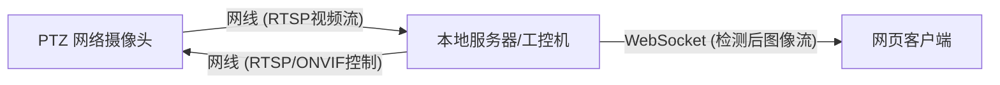

# 智能羊群监控与追踪系统设计文档

## 1. 项目概述 (Project Overview)
本项目旨在构建一个软硬件结合的智能监控系统，用于牧场环境下的羊群监测。系统通过网线直连 PTZ（云台）摄像头，利用本地计算机的算力进行实时 AI 识别，实现自动追踪羊群、越界报警、并在手绘地图上实时可视化羊群位置。

## 2. 系统架构 (System Architecture)

### 2.1 硬件拓扑


### 2.2 技术栈
*   **后端**: Python
    *   **视频处理**: OpenCV (读取 RTSP 流, 图像预处理)
    *   **AI 推理**: YOLOv8 (NCNN/ONNX 格式，适配低算力 CPU)
    *   **摄像头控制**: ONVIF 协议库 (python-onvif-zeep) 或 HTTP API
    *   **Web 服务**: FastAPI (提供 HTTP API 和 WebSocket 服务)
*   **前端**: HTML5, JavaScript, TailwindCSS (如需)
    *   **视频显示**: WebSocket 接收 Base64/Blob 图片帧并在 `<canvas>` 或 `` 渲染
    *   **地图交互**: Canvas API (绘制手绘地图及羊群光点)

## 3. 核心功能模块

### 3.1 视频流处理与 AI 检测 (Video & AI)
*   **输入**: 通过 `cv2.VideoCapture` 读取摄像头的 RTSP 地址（需配置电脑 IP 与摄像头在同一网段）。
*   **处理**: 每秒抓取特定帧数（如 3 FPS）进行 YOLOv8 模型推理。
*   **输出**: 
    1.  带有检测框（Bounding Box）的处理后图片。
    2.  羊群在视频画面中的像素坐标 $(u, v)$。

### 3.2 自动追踪与 PTZ 控制 (Auto-Tracking & PTZ)
*   **逻辑**: 计算画面中所有羊的**质心（Centroid）**。
*   **PID 控制**: 
    *   如果质心偏离画面中心向左，通过 ONVIF 发送 `Pan Left` 指令。
    *   如果质心偏离画面中心向右，发送 `Pan Right` 指令。
    *   设置死区（Deadzone），防止摄像头频繁抖动。
*   **手动接管**: 前端提供方向按钮，按下时暂停自动追踪 5 秒，执行手动指令。

### 3.3 坐标映射系统 (Coordinate Mapping)
*   **需求**: 将视频画面坐标 $(u, v)$ 转换为手绘地图坐标 $(x, y)$。
*   **实现**: **透视变换 (Perspective Transformation)**。
    *   **校准阶段**: 在前端从视频画面选取 4 个标志性点（如围栏四角），并在手绘地图上点出对应的 4 个点。
    *   **计算**: 后端生成单应性矩阵（Homography Matrix）。
    *   **运行时**: 实时将检测到的羊脚底坐标通过矩阵乘法映射到地图上。

### 3.4 实时监控前端 (Web Dashboard)
*   **布局**: 
    *   **左侧**: 实时监控画面（AI 处理后的可视化流）。
    *   **右侧**: 交互式电子地图（背景为手绘图，上面有动态红点代表羊）。
    *   **底部**: 云台控制面板（上/下/左/右/放大/缩小/自动模式开关）。

## 4. 接口设计 (API Design)

### 4.1 WebSocket: `/ws/video`
*   **方向**: Server -> Client
*   **内容**: 实时推送处理后的 JPEG 图片二进制数据。
*   **频率**: 与 AI 处理帧率同步（约 3-5 FPS）。

### 4.2 WebSocket: `/ws/data`
*   **方向**: Server -> Client
*   **内容**: JSON 格式的羊群坐标数据。
    ```json
    {
      "timestamp": 1705681234,
      "sheep_count": 5,
      "positions": [
        {"id": 1, "map_x": 120, "map_y": 300},
        {"id": 2, "map_x": 140, "map_y": 310}
      ],
      "alarm": false
    }
    ```

### 4.3 HTTP: `/api/ptz/control`
*   **Method**: POST
*   **Body**: `{"action": "move_left", "speed": 0.5}`
*   **功能**: 控制摄像头移动。

## 5. 开发步骤 (Implementation Roadmap)

1.  **连接测试**: 配置静态 IP，确保电脑能 `ping` 通摄像头，并能 VLC 播放 RTSP 流。
2.  **PTZ 对接**: 使用 Python 脚本测试控制摄像头转动。
3.  **AI 集成**: 将之前的 YOLO NCNN 代码封装为异步服务。
4.  **坐标映射**: 编写一个简单的校准工具脚本，计算矩阵。
5.  **Web 开发**: 搭建 FastAPI，编写前端页面，联调 WebSocket。
6.  **现场调试**: 调整 PID 参数，优化追踪平滑度。

## 6. 注意事项
*   **算力瓶颈**: 鉴于 CPU 较弱，图像传输建议压缩质量（JPEG Quality 70），地图坐标仅传输数据。
*   **坐标误差**: 手绘地图如果不成比例，映射会有偏差。尽量通过卫星图描绘手绘图。
*   **网络延迟**: 网线直连延迟极低，但 WebSocket 推图要注意包大小。
